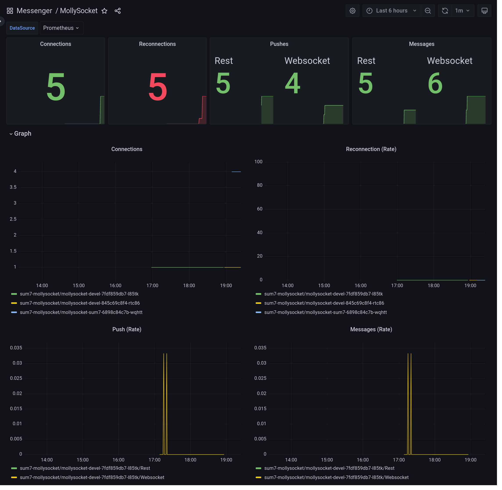

# MollySocket for Kubernetes

## Helm chart for deploying MollySocket in Kubernetes cluster

Prepare your configuration of the MollySocket helm release by creating your values file e.g. `my_values.yml`
for all options see default values.yaml from the chart: [/charts/mollysocket/values.yaml](/charts/mollysocket/values.yaml)

```yaml

mollysocket:
  log: "warn"

## here is the sqlite file stored
persistence:
  enabled: true

## you should not change, till you have support for
## a. your cluster support accessMode=ReadWriteMany  or b. MollySocket support external databases
replicaCount: 1


ingress:
  enabled: true
  hosts:
    - host: chart-example.local
      paths:
        - path: /
          pathType: ImplementationSpecific
  tls:
    - secretName: chart-local-cert
      hosts:
        - chart-example.local
```

Installation with following commands:

```bash
helm repo add mollysocket-repo https://mollysocket.github.io/helm/
helm install --create-namespace --namespace mollysocket my-mollysocket mollysocket-repo/mollysocket -f my_values.yml
```

## Testing

```bash
curl "https://chart-example.local/"
```

result:
  
```json
{"mollysocket":{"version":"0.1.0"}}
```

### Monitoring

Works well with [Prometheus Operator](https://prometheus-operator.dev/) ([Helmchart](https://artifacthub.io/packages/helm/prometheus-community/kube-prometheus-stack)) by enabling following values:

```yaml
prometheus:
  servicemonitor:
    enabled: true
    labels:
      release: "kube-prometheus-stack"
  rules:
    # will deploy alert rules
    enabled: true
    labels:
      release: "kube-prometheus-stack"
    # current no default alertrules are provided, here a few additiona examples:
    additionalRules:
      # alert if any message is recieved (and pushed)
      - alert: "MollyMessage"
        expr: 'increase(mollysocket_messages[5m]) > 0'
        labels: 
          severity: "critical"
        annotations:
          summary: "Got New Message for {{ $labels.uuid }}"
          description: "Got New Message for {{ $labels.uuid }} per {{ $labels.type }} count: {{ $value }}"
grafana:
  dashboards:
    enabled: true
```



PS: The labels `release=kube-prometheus-stack` is setup with the helmchart of the Prometheus Operator.

## TODO

- Working with [Banzai Logging Operator](https://banzaicloud.com/docs/one-eye/logging-operator/)
  - Waiting for Serizable-Log Support for MollySocket: https://github.com/MollySocket/mollysocket/issues/5
  - [ ] Flow with Serilizer
  - [ ] optional Output (if not ClusterOutput)